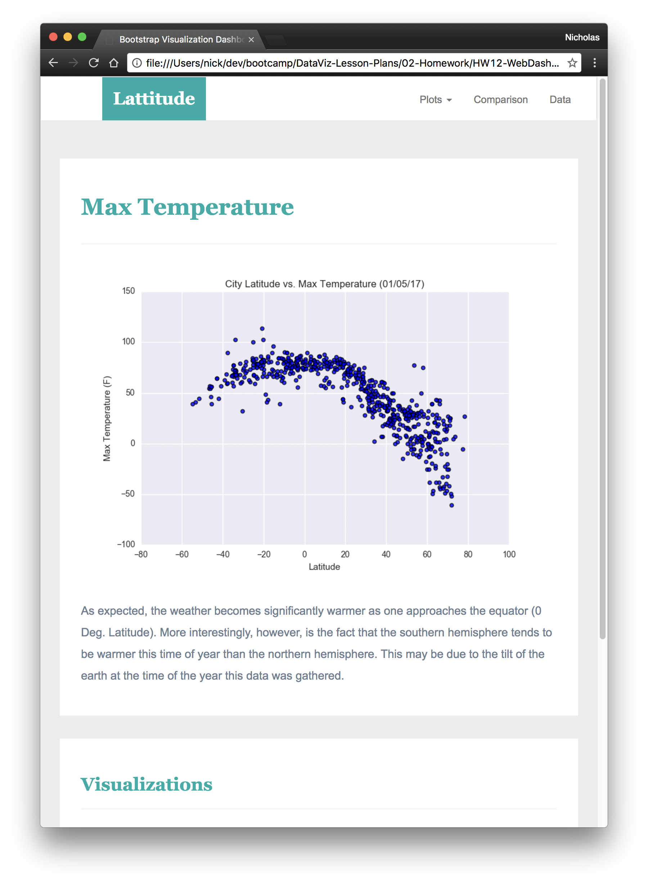

# Web Design Homework - Web Visualization Dashboard (Latitude)

## Background

Data is more powerful when we share it with others! Let's take what we've learned about HTML and CSS to create a dashboard showing off the analysis we've done.

### Before You Begin

1. Create a new repository for this project called `Web-Design-Challenge`. **Do not add this homework to an existing repository**.

2. Clone the new repository to your computer.

3. Inside your local git repository, create a directory for the web challenge. Use a folder name to correspond to the challenge: **WebVisualizations**.

4. Add your **html** files to this folder as well as your **assets**, **Resources** and **visualizations** folders.

5. Push the above changes to GitHub or GitLab.

6. Deploy to GitHub pages. 

## Latitude - Latitude Analysis Dashboard with Attitude

[weather data](Resources/cities.csv).

### Website Requirements

The website must consist of 7 pages total.

### Considerations

### Bonuses

### Screenshots

This section contains screenshots of each page that must be built, at varying screen widths. These are a guide; you can meet the requirements without having the pages look exactly like the below images.

#### Landing page

Large screen:

Small screen:



#### Comparisons page

Large screen:

Small screen:

#### Data page

Large screen:

Small screen:

#### Visualization pages

You'll build four of these, one for each visualization. Here's an example of one:

Large screen:

Small screen:

#### Navigation menu

Large screen:

Small screen:

### Copyright

Trilogy Education Services © 2019. All Rights Reserved.
